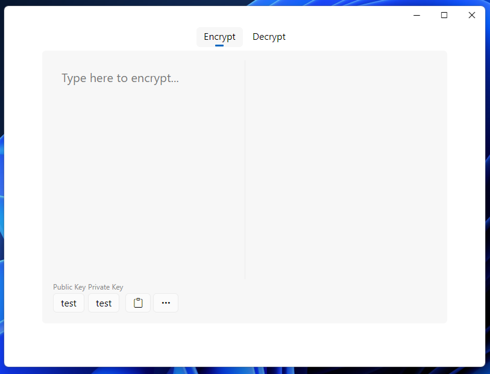
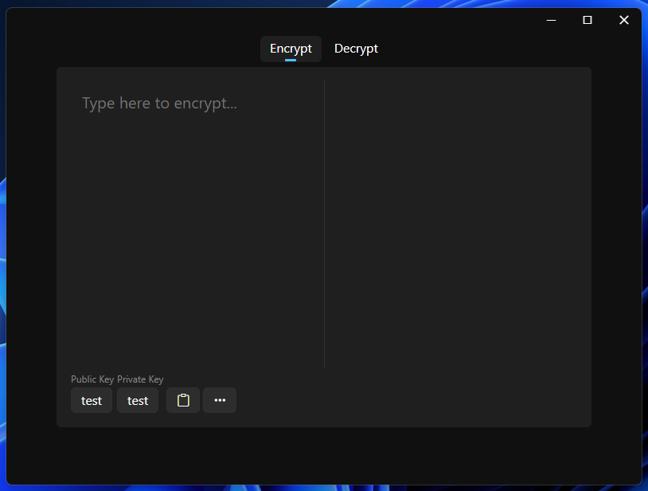
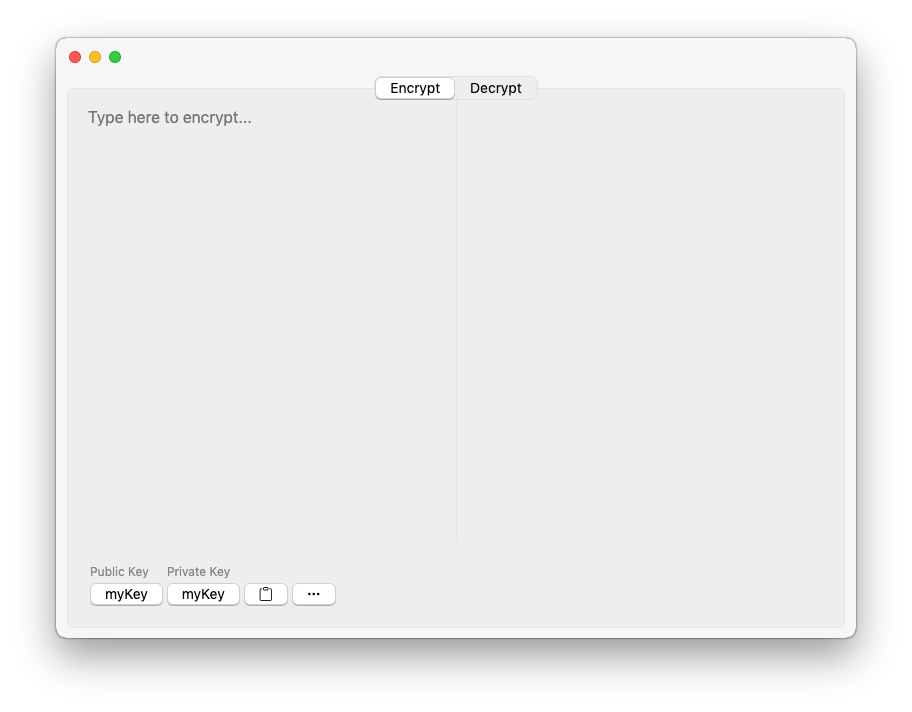
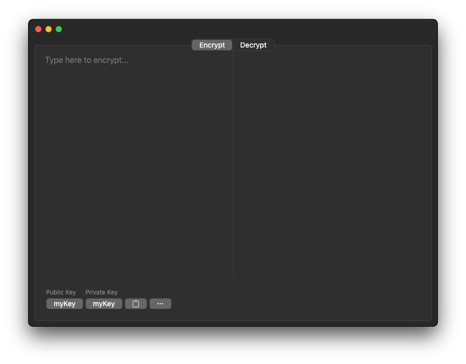

<p align="center"></p>

<h3 align="center">RSA GUI</h3>

<p align="center">The GUI for <a href="https://github.com/MrWillCom/rsa-cli">RSA CLI</a>.</p>

## Installation

Download installer from [Releases](https://github.com/MrWillCom/rsa-gui/releases). And follow the instructions in the installers to install RSA GUI.

Plus, we recommend you to install [RSA CLI](https://github.com/MrWillCom/rsa-cli) for more advanced configurations.

If you didn't find the right installer, check [Development](#development) to build one.

## Development

1. Install dependencies:
   ```sh
   $ yarn install
   ```
2. Build source code:
   ```sh
   $ yarn run build
   ```
3. Launch the app:
   ```sh
   $ yarn start
   ```
4. Build installer for this app:
   ```sh
   $ yarn run dist
   ```

## Key Features

- Instant en/decryption preview.
- Dynamic native-like UI on Windows & macOS.
- ...

## Preview








